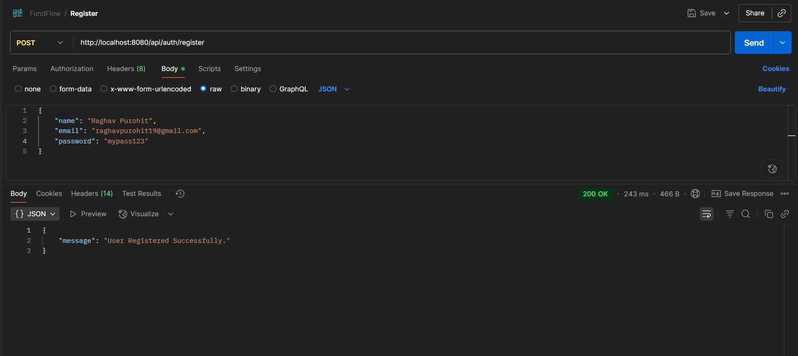
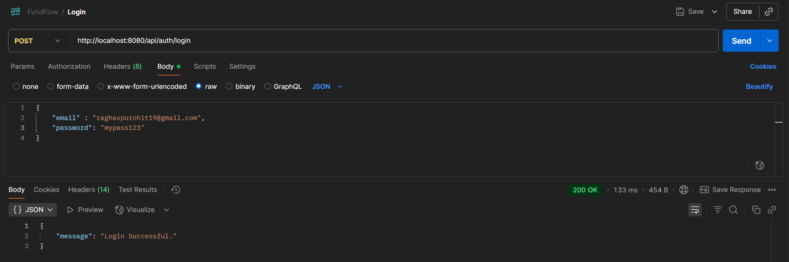
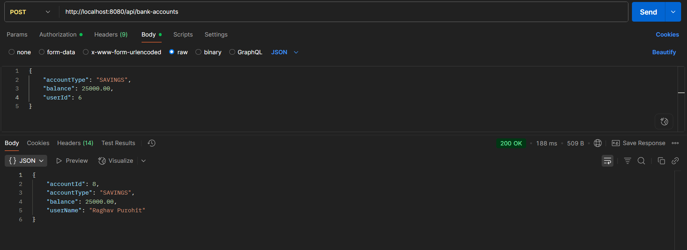
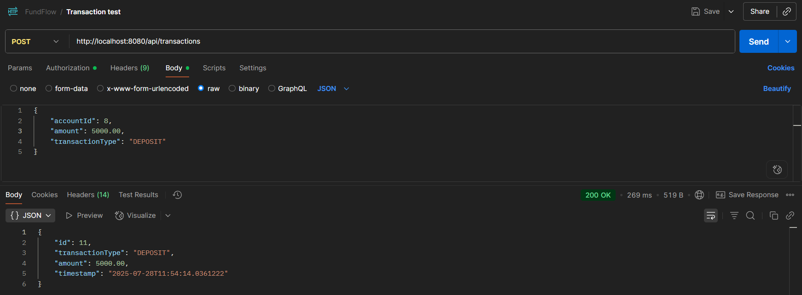
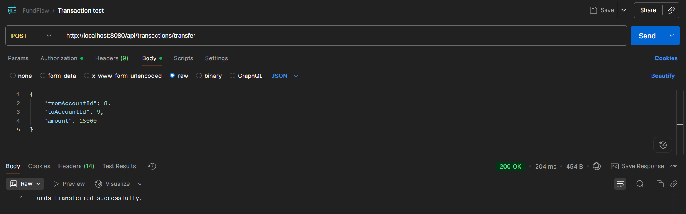
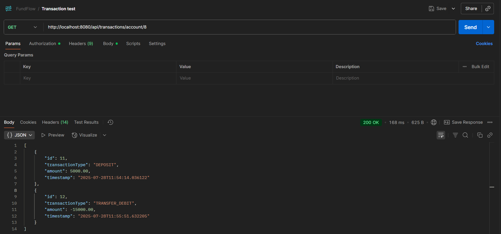

# 💰 FundFlow – Digital Banking System

FundFlow is a backend-focused digital banking system built using **Spring Boot**. It enables users to manage their bank accounts, transfer funds, and view transaction history securely. The application follows RESTful principles and implements secure authentication and role-based access control.

---

## 🚀 Key Features

- ✅ User Registration & Login
- 🔐 Role-based Authentication & Authorization (`USER`, `ADMIN`)
- 💳 Bank Account Operations:  
  - Create, Read, Update, Delete Accounts  
  - Deposit & Withdraw Funds  
  - Transfer Between Accounts  
  - Check Account Balance  
  - View Transaction History
- 👥 Admin Access to Manage All Users & Accounts
- 🔑 Secure Password Hashing with Bcrypt
- 📬 Fully Tested using Postman (Collection Included)

---

## 🛠️ Tech Stack

- **Java 22**
- **Spring Boot**
- **Spring Security**
- **Spring Data JPA + MySQL**
- **Maven**
- **Postman** (for API testing)

---

## 🧠 What I Learned

- Designed a clean **3-layer architecture** (Controller → Service → Repository)
- Managed complex entity relationships (e.g., User ↔ BankAccounts ↔ Transactions)
- Implemented custom security with `UserDetailsService` & `SecurityFilterChain`
- Applied granular access control using `@PreAuthorize`
- Built clean, testable, and modular code using DTOs and service interfaces

---

## 🧪 Running the Project Locally

```bash
# 1. Clone the repository
git clone https://github.com/your-username/fundflow.git
cd fundflow

# 2. Create a MySQL database (e.g., fundflow_db)

# 3. Configure application.properties
spring.datasource.url=jdbc:mysql://localhost:3306/fundflow_db
spring.datasource.username=root
spring.datasource.password=yourpassword

# 4. Run the application
./mvnw spring-boot:run
```

## 🔮 Future Enhancements

- 🔐 **JWT-based Authentication**  
  Token issuance, refresh token mechanism, and token expiry handling.

- 🖥️ **Minimal React Frontend**  
  A user-friendly dashboard to view accounts, make transactions, and check balances.

- 📜 **Swagger/OpenAPI Documentation**  
  Auto-generated and interactive API documentation for better testing and developer experience.

- 📈 **Exportable Transaction Reports**  
  Generate transaction history in PDF or CSV formats for users.

- 📩 **Email Notifications**  
  Send email alerts on successful transactions or account changes.

### 📸 API Testing Snapshots (via Postman)

#### 🔐 Register User


#### 🔑 Login User


#### 🏦 Create Bank Account


#### 💰 Deposit Money


#### 🧾 Withdraw Money


#### 🔁 Transfer Between Accounts


#### 📜 Transaction History


